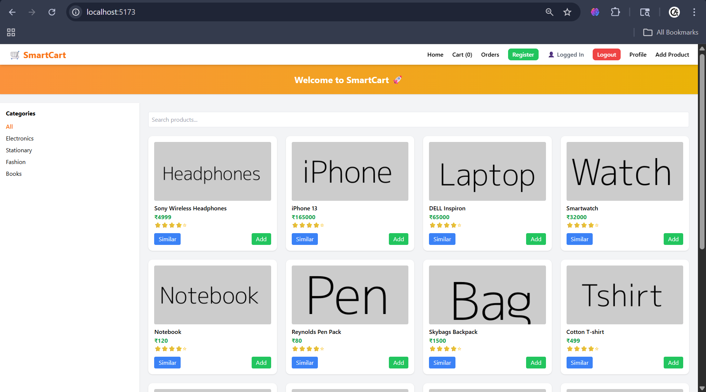
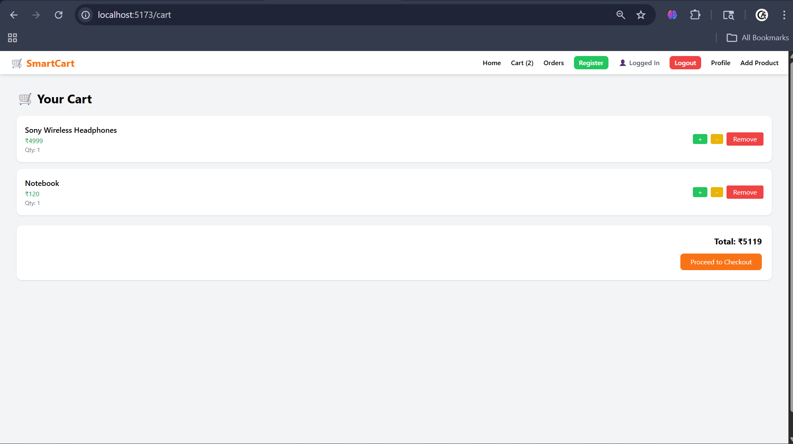
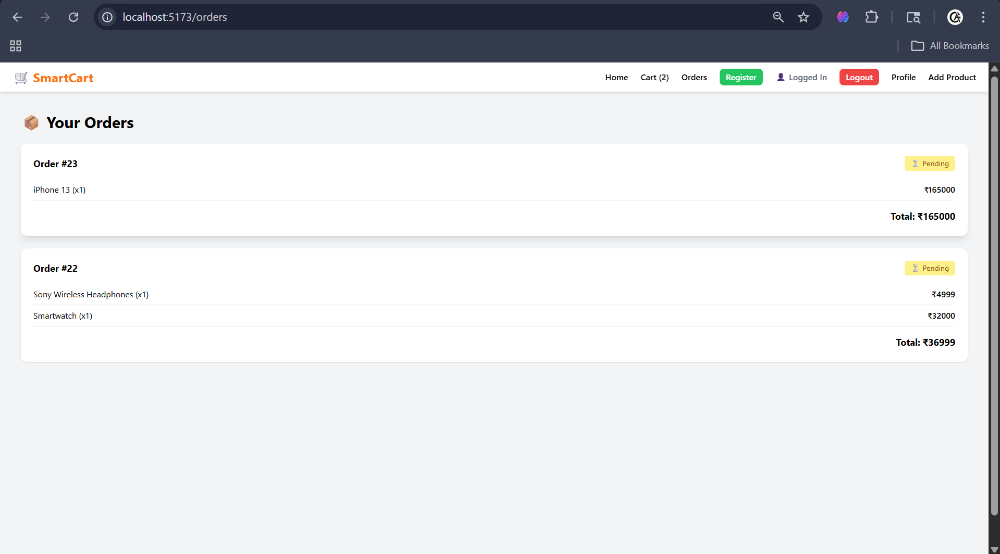
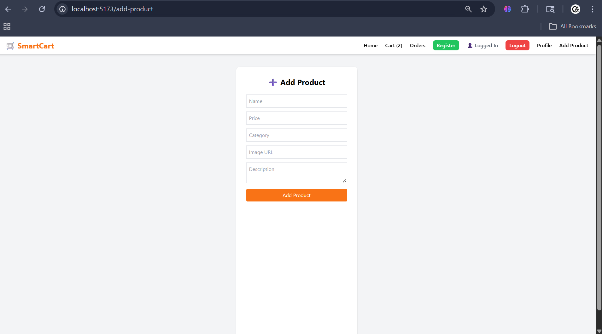

# 🛒 SmartCart AI

An AI-powered full-stack e-commerce web application built using React and Django REST Framework.

---

## 🚀 Features

- 🔐 User Authentication (JWT-based login & register)
- 🛍 Product Browsing with Search & Category Filtering
- 🤖 AI-Based Product Recommendation System
- 🛒 Smart Cart with Quantity Management
- 💳 Checkout Flow with Order Placement
- 📦 Order History for each user
- 👤 User Profile Page
- 🎨 Modern UI using Tailwind CSS

---

## 🛠 Tech Stack

**Frontend:**
- React (Vite)
- Tailwind CSS
- Axios

**Backend:**
- Django
- Django REST Framework
- JWT Authentication

**Database:**
- SQLite

---

## 🧠 How Recommendation Works

The recommendation system suggests products based on category similarity.  
When a user views or selects a product, the backend fetches similar products from the same category and displays them as recommendations.

---

## 📸 Screenshots

### 🏠 Home Page


### 🛒 Cart Page


### 📦 Orders Page


### 📱 Product Details


---

## ▶️ Run Locally

### 1️⃣ Clone Repo
```bash
git clone https://github.com/Anandhitha20/smartcart-ai.git
cd smartcart-ai